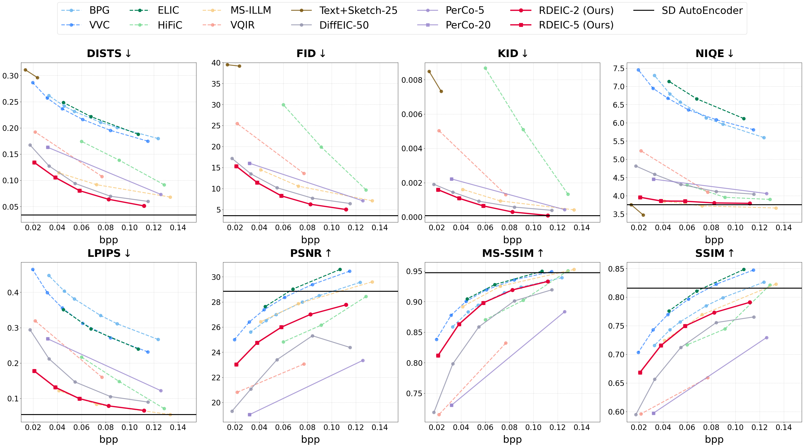
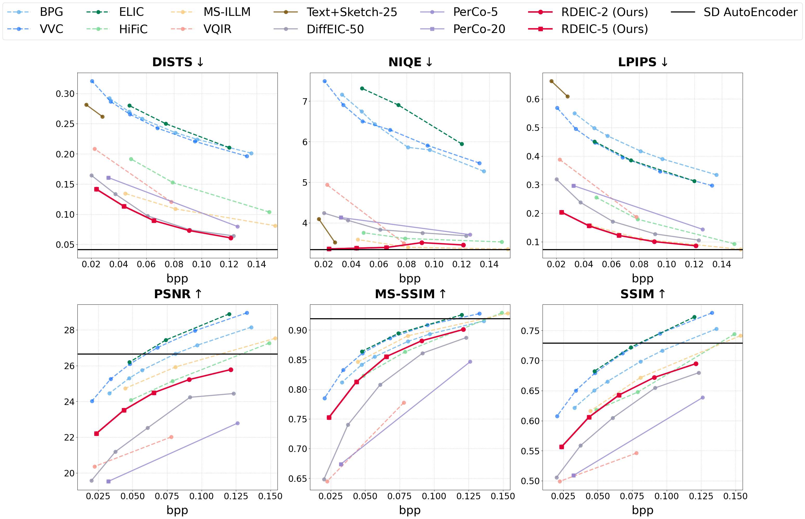

# RDEIC: Accelerating Diffusion-Based Extreme Image Compression with Relay Residual Diffusion

> [Zhiyuan Li](https://github.com/huai-chang), Yanhui Zhou, [Hao Wei](https://github.com/cshw2021), Chenyang Ge, [Ajmal Mian](https://research-repository.uwa.edu.au/en/persons/ajmal-mian)<br>
> :partying_face: This work is accepted by IEEE Transactions on Circuits and Systems for Video Technology.
 
:star: The quantitative metrics for each method presented in our paper can be found in [result.xlsx](/indicators/results.xlsx).

<p align="center">
    <br>
</p>


## <a name="visual_results"></a>:eyes: Visual Results
<details> <summary> Visual comparisons on the CLIC2020 dataset </summary>
<p align="center">
    <br>
    <br>
</p>
</details>

<details> <summary> Balance between smoothness and sharpness </summary>
<p align="center">
    <br>
    <br>
</p>
</details>

## <a name="quantitative_performance"></a>:crossed_swords: Quantitative Performance
<details> <summary> CLIC2020 dataset </summary>
<p align="center">
    <br>
</p>
</details>

<details> <summary> Tecnick dataset </summary>
<p align="center">
    <br>
</p>
</details> 

<details> <summary> Kodak dataset </summary>
<p align="center">
    <br>
</p>
</details> 

## <a name="robustness_generalization"></a>:shield: Robustness and Generalization

### Fault Robustness: Resilience to Simulated Bit Errors

We investigate the model's behavior under noisy channel conditions by simulating transmission errors at two levels:

- **Bitstream-level corruption**: Bit flips before entropy decoding at error rates $p \in \{0\%, 0.1\%, 0.5\%, 1\%, 2\%, 5\%, 10\%\}$ (random and burst errors)
- **Latent-level corruption**: Gaussian additive noise ($\sigma \in \{0, 5, 10, 20, 50, 100\}$) and mask-replace corruption on decoded latents

**Key Findings:**
- **Bitstream corruption is catastrophic**: At 0.1% random bit error rate, quality degrades dramatically (PSNR: 22.5→9.07 dB, MS-SSIM: 0.90→0.13, LPIPS: 0.08→0.88). Decode failures begin at 0.5% (66.7%), reaching 100% at 2%+.
- **Latent corruption shows remarkable robustness**: With additive Gaussian noise at $\sigma = 100$, quality remains acceptable (PSNR 17.61 dB, MS-SSIM 0.76, LPIPS 0.27) with zero decode failures.
- **Comparison with JPEG2000**: At similar bitrates (~0.12 bpp), JPEG2000 shows greater sensitivity (46.7% decode failures at 0.1% vs. RDEIC's 0%).

**Implications**: Error correction should be applied at the bitstream level using FEC codes. Once correctly decoded, the diffusion decoder provides inherent error resilience against moderate latent perturbations.

### Domain Generalization: Out-of-Distribution Performance

We evaluate RDEIC's generalization to domains far from natural photographs on three OOD datasets:

- **EuroSAT**: Satellite land-use imagery
- **TU-Berlin Sketches**: Hand-drawn line art sketches  
- **Galaxy10 DECals**: Astronomical images of galaxies

**Fine-Tuning Results:**

| Dataset | Config | BPP | PSNR (dB) | SSIM | MS-SSIM | LPIPS |
|---------|--------|-----|-----------|------|---------|-------|
| LSDIR | Before/After | 0.0835 | 17.53 | 0.7695 | 0.9253 | 0.0835 |
| TU-Berlin | Before | 0.0820 | 14.25 | 0.6850 | 0.8200 | 0.4500 |
| TU-Berlin | After | 0.0745 | 16.06 | 0.7290 | 0.8811 | 0.1316 |
| EuroSAT | Before | 0.2150 | 20.85 | 0.6450 | 0.8500 | 0.3500 |
| EuroSAT | After | 0.2220 | 24.42 | 0.6917 | 0.8251 | 0.1221 |
| Galaxy10 | Before | 0.2280 | 21.20 | 0.6580 | 0.8150 | 0.3200 |
| Galaxy10 | After | 0.2311 | 25.63 | 0.7317 | 0.8352 | 0.1252 |

**Key Findings:**
- **Light fine-tuning significantly improves OOD performance**: Fine-tuning only the conditioning adapter (keeping Stable Diffusion UNet frozen) for 5,000 steps (~30 minutes on L4 GPU) dramatically improves results.
- **EuroSAT**: LPIPS improves from 0.35 to 0.1221
- **TU-Berlin**: LPIPS improves from 0.45 to 0.1316  
- **Galaxy10**: LPIPS improves from 0.32 to 0.1252

**Recommendations for OOD deployment:**
1. Domain-specific fine-tuning of the conditioning adapter (~30 min training)
2. Semantic prompt conditioning to guide reconstruction
3. Validation with domain experts to ensure preservation of domain-critical features

## :wrench: Installation

```bash
# clone this repo
git clone https://github.com/huai-chang/RDEIC.git
cd RDEIC

# create an environment
conda create -n rdeic python=3.8
conda activate rdeic
pip install torch==2.0.1
pip install tb-nightly --index-url https://pypi.org/simple
pip install -r requirements.txt
```

## <a name="train"></a>:computer: Train

### Preparation
1. Download [LSDIR dataset](https://pan.baidu.com/s/1IvowtZSRAPn_CnhhASEqgw?pwd=nck8).
   
2. Generate file list of training set and validation set.

   ```
   python3 make_fire_list.py\
   --train_folder [path_to_train_folder]\
   --test_folder [path_to_test_folder]\
   --save_folder [path_to_save_floder]
   ```
   After running this script, you will get two file lists in save_folder, each line in a file list contains an absolute path of an image file:

   ```
   save_folder
   ├── train.list # training file list
   └── valid.list # validation file list
   ```

3. Download pretrained [Stable Diffusion v2.1](https://huggingface.co/stabilityai/stable-diffusion-2-1-base) into `./weight`.
   ```
   wget https://huggingface.co/stabilityai/stable-diffusion-2-1-base/resolve/main/v2-1_512-ema-pruned.ckpt --no-check-certificate
   ```

### Independent training
1. Modify the configuration file.
   ```
   # ./configs/train_rdeic.yaml
   resume: ~ or path to the initial checkpoint
   default_root_dir: path to save logs and checkpoints

   # ./configs/model/rdeic.yaml
   is_refine: False
   learning_rate: 1e-4 or 2e-5
   l_guide_weight: 2 #{2,1,0.5,0.25,0.1}
   ```

2. Start training.
   ```
   python3 train.py
   ```

### Fixed-step fine-tuning
1. Modify the configuration file. 
   ```
   # ./configs/train_rdeic.yaml
   resume: path to the initial checkpoint
   default_root_dir: path to save logs and checkpoints.

   # ./configs/model/rdeic.yaml
   is_refine: True
   fixed_step: 2 or 5
   learning_rate: 2e-5
   l_guide_weight: 2 #{2,1,0.5,0.25,0.1}

   # ./configs/dataset/lic_train.yaml
   out_size: 256
   ```

2. Start training.
   ```
   python3 train.py
   ```

### OOD Domain Fine-Tuning

To adapt RDEIC to out-of-distribution domains (e.g., satellite imagery, sketches, astronomical images):

1. Prepare your OOD dataset and create file lists (similar to LSDIR preparation).

2. Modify the configuration file for fine-tuning:
   ```
   # ./configs/finetune_ood.yaml
   resume: path to the pre-trained RDEIC checkpoint
   default_root_dir: path to save logs and checkpoints
   
   # ./configs/model/rdeic_finetune_ood.yaml
   sd_locked: True  # Keep Stable Diffusion UNet frozen
   learning_rate: 2e-5
   max_steps: 5000
   ```

3. Start fine-tuning (only the conditioning adapter will be updated):
   ```
   python3 train.py --config configs/finetune_ood.yaml
   ```

This light fine-tuning approach requires ~30 minutes on L4 GPU and enables effective generalization to diverse visual domains without expensive retraining of the entire model.

## <a name="inference"></a>:zap: Inference
1. Download pretrained [Stable Diffusion v2.1](https://huggingface.co/stabilityai/stable-diffusion-2-1-base) into `./weight`.
   ```
   wget https://huggingface.co/stabilityai/stable-diffusion-2-1-base/resolve/main/v2-1_512-ema-pruned.ckpt --no-check-certificate
   ```

2. Download the pre-trained weights for the [Compression and Control Module](https://drive.google.com/drive/folders/1etNq6TqGQYaxih2RFL_ILenRWYcyxyDf?usp=share_link) into `./weight`.

3. Download [test datasets](https://drive.google.com/drive/folders/1_EOEzocurEwETqiCjZjOrN_Lui3HaNnn?usp=share_link).

4. Run the following command.

   ```
   python3 inference_partition.py \
   --ckpt_sd ./weight/v2-1_512-ema-pruned.ckpt \
   --ckpt_cc ./weight/rdeic_2_step2.ckpt \
   --config configs/model/rdeic.yaml \
   --input inputs/0001000 \
   --output outputs/withCaption1aug2 \
   --steps 2 \
   --device cuda
   --use_captions

   ```


## <a name="todo"></a>:memo: TODO
- [x] Release code
- [x] Release pretrained models

## <a name="acknowledgement"></a>:heart: Acknowledgement
This work is based on [DiffEIC](https://github.com/huai-chang/DiffEIC) and [CVQ-VAE](https://github.com/lyndonzheng/cvq-vae), thanks to their invaluable contributions.

## <a name="cite"></a>:clipboard: Citation

Please cite us if our work is useful for your research.
```
@article{li2024diffusion,
  title={Diffusion-based Extreme Image Compression with Compressed Feature Initialization},
  author={Li, Zhiyuan and Zhou, Yanhui and Wei, Hao and Ge, Chenyang and Mian, Ajmal},
  journal={arXiv preprint arXiv:2410.02640},
  year={2024}
}
```